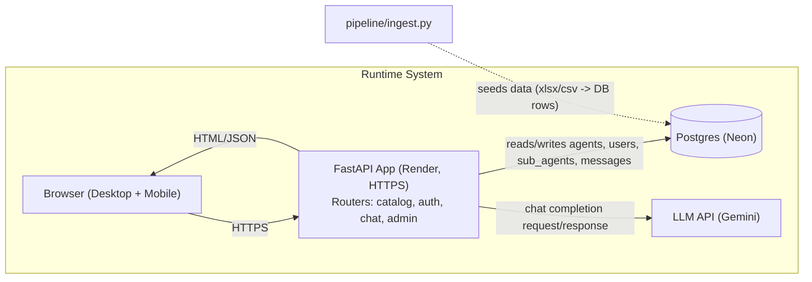
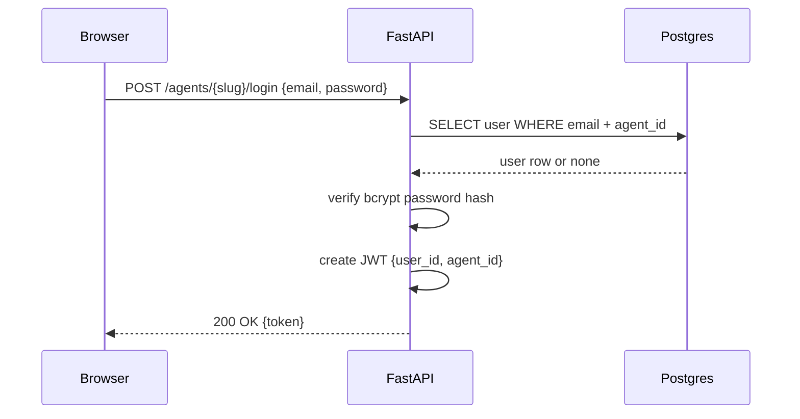
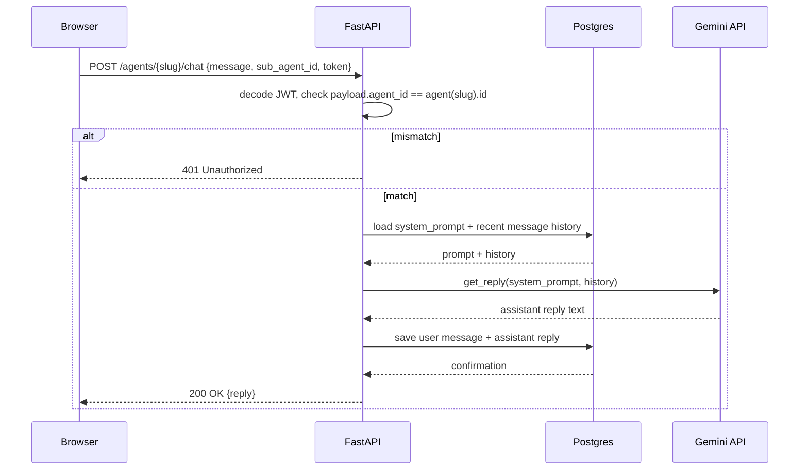
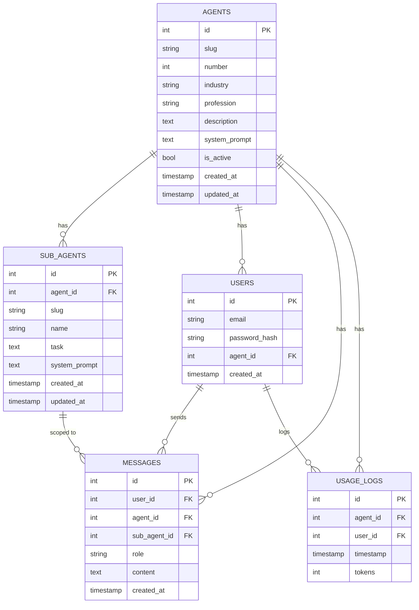

# AgentHub

A "Play Store" for AI agents: browse a catalog of ~100 profession-specific AI agents (doctor, lawyer, accountant, software engineer, ...), sign in for the one agent you picked, and chat with it — powered by a real LLM (Gemini), in character.

**Live:** https://agenthub-hxt8.onrender.com/
**Repo:** https://github.com/zonieedhossain/agenthub
*(hosted on Render's free tier, served over HTTPS via Render's automatic TLS termination — the instance spins down after ~15 minutes of inactivity, so the first request after a while can take 20–30s to wake up)*

## Test accounts

Login is scoped per agent (see [Auth design](#auth-design) below), so a token minted for one agent's account does not work on another agent. To verify isolation yourself, either sign up fresh under two different agents, or use:

| Agent | URL | Email | Password |
|---|---|---|---|
| Financial Controller | `/agents/financial-controller/auth` | `agenthub.demo@gmail.com` | `Demo12345!` |
| Chartered Accountant | `/agents/chartered-accountant/auth` | `agenthub.demo@gmail.com` | `Demo12345!` |

Same email, two separate accounts (one per agent) — the token from one will return `401` if used against the other's chat endpoint. Signup is open, so you can also just create your own account under any of the ~100 agents from the catalog.

## Architecture

### Agents are data, not code

There is exactly one `Agent` model and one `SubAgent` model (`app/models.py`). Every one of the ~100 catalog entries — and every sub-agent under them — is a row in those two tables, not a Python class or a code path. The chat endpoint (`app/routers/chat.py`) resolves whichever agent/sub-agent the request names and passes its `system_prompt` column straight to the LLM call. Adding agent #101 means adding a row (via the pipeline script or the `/admin/agents` endpoint below) — no new code, no redeploy.

Every one of the ~100 seeded agents ships with up to 4 sub-agents already — comfortably exceeding the assignment's "at least 5 agents, 3 with 2–5 sub-agents" requirement, since this holds for the entire catalog, not just a hand-picked few.

### Content pipeline

`pipeline/ingest.py` turns raw agent data (originally `agents_sample.csv`, converted to `.xlsx` here for convenience — `run()` reads it via `pandas.read_excel()`; swapping in `read_csv()` for a raw CSV source is a one-line change since everything downstream just operates on the resulting DataFrame) into working agent configs:

- `upsert_agent()` is the single function that generates a system prompt from a template (`MAIN_PROMPT`/`SUB_PROMPT`) given a profession, industry, and up to 4 sub-agent (name, task) pairs, then creates or updates the `Agent`/`SubAgent` rows.
- `run()` batch-imports the whole spreadsheet on app startup (see `lifespan` in `app/main.py` — it seeds the DB automatically the first time it connects).
- The **same** `upsert_agent()` function backs `POST /admin/agents`, so a single agent can be added or updated by hand through the admin UI with zero code changes — the CSV import and the admin form are two callers of one code path, not two implementations.

### Auth design

Each agent gets its own login boundary using a **shared auth system, tenant-scoped by `agent_id`** — not fully separate systems per agent. Concretely:

- `User` rows have a composite unique constraint on `(email, agent_id)` — the same email can sign up under multiple agents as *different* accounts.
- On signup/login, a JWT is issued with both `user_id` and `agent_id` embedded in the payload.
- Every authenticated request carries the agent's `slug` in the URL. `get_current_user` (`app/dependencies.py`) decodes the token and explicitly checks `payload["agent_id"] != agent.id` — a token minted for one agent is rejected outright on any other agent's endpoints, even though it's cryptographically valid.

**Why shared-and-scoped over fully separate systems:** with ~100 (and growing) agents, running fully independent auth stacks per agent doesn't scale operationally — every agent would need its own user table, its own secret, its own session store. A single `users` table with an `agent_id` column and an isolation check enforced at the dependency layer gives the same guarantee (one login literally cannot be used elsewhere) with one schema and one code path to secure and test. The tradeoff is that the isolation check lives in application code rather than being structurally impossible — which is why it's covered directly by tests (`tests/test_auth.py::test_token_from_one_agent_rejected_on_another`), not just assumed.

Passwords are hashed with bcrypt (`passlib`), never stored or logged in plaintext. `.env` (secrets) is gitignored and was never committed.

### System diagrams

**High-level architecture** — one FastAPI app behind Render's TLS, one Postgres instance, one outbound call per chat turn to Gemini. `ingest.py` is a one-shot/re-runnable script, not a long-running service.



**Login flow** — the isolation check lives here: the JWT payload carries `agent_id`, and every subsequent request re-validates it against the agent named in the URL.



**Chat flow** — the same isolation check, enforced again on every message, not just at login:



**Schema** — `UNIQUE(email, agent_id)` on `users` is what makes per-agent login isolation a database constraint, not just an application-level convention:



### Stack, and why each piece

| Choice | What | Why this over the alternatives |
|---|---|---|
| **Backend framework** | FastAPI | Required to be FastAPI or Django by the assignment. Picked FastAPI over Django specifically because this app is a thin JSON/HTML API with no admin-site scaffolding, ORM-agnostic model layer, or template-heavy MVC needs Django is built around — FastAPI's dependency-injection system (`Depends(get_current_user)`, `Depends(get_db)`) maps directly onto "resolve the agent-scoped user, then check the DB," and Pydantic schemas give free request validation (see the admin form validation) without extra libraries. |
| **ORM / DB** | SQLAlchemy + Postgres (Neon free tier) in production, SQLite for tests | Postgres over SQLite in production because the app is meant to be genuinely multi-user/concurrent (many chat sessions writing `Message`/`UsageLog` rows at once) — SQLite's single-writer lock isn't a good fit for that, even at small scale. Neon specifically because it's a real managed Postgres with a usable free tier and no server to provision. SQLite for tests because the whole suite needs to spin up and tear down a fresh schema per test in-process with zero external dependencies — swapping the engine URL is the only difference (`tests/conftest.py`), which is also why "tests only run against SQLite, never Postgres" made it into Known Limitations below rather than being silently ignored. |
| **Frontend** | Jinja2-rendered pages + vanilla JS, no framework, no build step | The assignment left this open, and the actual UI surface (catalog, agent detail, auth, chat, admin) is four page types with straightforward client-server data flow — not enough state or component reuse to justify React/Vue's overhead, and a build step is one more thing that can break "loads and functions without you present to explain it." Shared behavior (the `esc()`/`colorFor()`/`toast()`/`apiErrorMessage()` helpers) lives in `base.html` and is reused across every page without a bundler. The tradeoff is real — no component model means the chat page's JS is one longer file instead of composed pieces — but for this scope it was the faster, more debuggable path, and it kept every fix in this session inspectable via `curl`/view-source instead of behind a build artifact. |
| **LLM provider** | Google Gemini (`google-genai`, `gemini-flash-latest`) | Assignment allowed any provider. Picked Gemini for a genuinely usable free tier during iterative development (signing up ~100 agents and repeatedly testing chat without hitting a paywall), and because the call is isolated behind one function (`get_reply()` in `app/llm.py`) that only the chat router calls — swapping to OpenAI/Anthropic is a matter of rewriting that one function's internals, not touching routing, auth, or the pipeline. |
| **Rate limiting** | `slowapi`, keyed by authenticated user (IP fallback only for unauthenticated requests) | Chosen over hand-rolling limiting because it's a small, FastAPI-native library with a decorator API (`@limiter.limit("15/minute")`) rather than middleware that has to be threaded through every route. Keyed by user rather than IP specifically because IP-based limiting would let one shared-network user's chat activity throttle everyone else behind the same IP/NAT — the fix for this (`get_current_user` setting `request.state.user`) is covered directly by a live-verified test where two different users behind one client IP get independent limit buckets. |
| **Deployment** | Render (`render.yaml`), free tier | Chosen over Railway/Fly.io for the least ceremony specifically for a FastAPI app: `render.yaml` declares the build/start commands directly, HTTPS is automatic with no separate certificate step, and the free web-service tier doesn't require a credit card to start. The real cost of the free tier is cold starts after ~15 minutes idle — documented in Known Limitations rather than hidden. |

### Admin panel

`/admin` is gated by HTTP Basic auth (`ADMIN_USER`/`ADMIN_PASSWORD`) behind a styled sign-in form (not a browser-native prompt). Once signed in:

- **Add/update an agent** through a form that calls the same `upsert_agent()` the CSV pipeline uses (see above) — validated server-side (`app/schemas.py`: minimum lengths, a positive agent number, up to 5 sub-agents) and checked client-side against the existing catalog before submit: if the typed profession already maps to an existing agent, a warning shows what's already there and the submit button relabels to "Update existing agent" instead of silently overwriting it.
- **Recently added / updated** — pulls the public `/agents` endpoint (already sorted most-recently-updated first) so a freshly added or edited agent is visible immediately, regardless of whether it has any chat activity yet.
- **Usage** — per-agent request/token counts from `UsageLog`.

Catalog ordering: both the public catalog and each agent's sub-agent list sort by `updated_at desc`, so editing an agent through the admin form brings it back to the top of the catalog.

## Setup

### Requirements
Python 3.11+, a Postgres database (or SQLite for local/dev), a Gemini API key.

### Environment variables

| Variable | Required | Notes |
|---|---|---|
| `DATABASE_URL` | Yes | e.g. `postgresql://...` or `sqlite:///./dev.db` |
| `JWT_SECRET` | Yes | any long random string |
| `GEMINI_API_KEY` | Yes | from Google AI Studio |
| `ADMIN_USER` / `ADMIN_PASSWORD` | Yes | gates the `/admin` UI and `/admin/*` API |

### Run locally

```bash
python -m venv venv
source venv/bin/activate  # or venv\Scripts\activate on Windows
pip install -r requirements.txt

# create a .env with the variables above

uvicorn app.main:app --reload
```

On first startup, the app connects to the DB, creates tables if needed, and seeds all ~100 agents from `pipeline/agents_sample.xlsx` automatically (see `lifespan` in `app/main.py`) — no manual migration step required. Visit `http://localhost:8000`.

### Run the content pipeline manually

```bash
python -m pipeline.ingest
```

Re-running it is idempotent — it upserts by slug, so it's safe to run again after editing the source spreadsheet.

### Tests

```bash
pytest tests/ -v
```

21 tests across three files:
- `test_auth.py` — signup, login, duplicate emails, wrong password, the short-password rejection, the login rate limit, and — the important one — cross-agent token isolation.
- `test_chat.py` — chat/config resolution: main-agent vs sub-agent system prompt resolution, and rejecting a sub-agent that belongs to a different agent.
- `test_admin.py` — admin auth gating, field validation (short profession/industry/sub-agent name, too many sub-agents, non-positive agent number), the create-vs-update distinction, the stale-sub-agent-removal fix, and catalog ordering.

Tests run against an in-memory SQLite DB via dependency override, no external services required — including the rate-limit test, which needed an autouse fixture (`tests/conftest.py::reset_rate_limiter`) to clear the limiter's shared in-memory state between tests, since every `TestClient` request looks like it comes from the same fake IP. CI (`.github/workflows/test.yml`) runs this suite on every push/PR to `main`.

## AI-assisted development

**Claude Code** (Anthropic) was used throughout this project's development, across both backend and frontend work — architecture decisions, implementation, and this README were all done in collaboration with it. Concretely, in addition to the frontend/UI work (the catalog/chat/admin redesign), it also found and fixed backend issues that unit tests alone hadn't caught by driving the deployed app in a real headless browser: the `/admin/stats` crash from missing imports, a rate-limiter bug that fell back to per-IP instead of per-user limiting, an XSS vulnerability in unescaped chat rendering, a route collision that made the agent detail page unreachable, and a schema-migration bug that silently left new rows with `NULL` timestamps — see commit history for the full list.

## Known limitations

- **Single shared admin credential** (`ADMIN_USER`/`ADMIN_PASSWORD`), not per-admin accounts — fine for a small team, not for a multi-admin org. Fixing this properly means a real admin-user table and its own auth flow, not a quick patch, so it's left as a deliberate scope cut rather than forced in.
- **Free-tier cold starts.** Render's free plan spins the instance down after inactivity; the first request afterward is slow. Not fixable without paid hosting.
- **Ad hoc schema migrations, no Alembic.** New columns (`created_at`/`updated_at`) get added to an already-seeded DB via a small guarded `ALTER TABLE` in `init_db()` rather than a real migration tool — fine at this scale, wouldn't scale to a team environment. (This approach already bit once: the first version used `server_default=func.now()`, which only takes effect when the DB column itself has a DDL-level default — a raw `ALTER TABLE` doesn't add one, so rows inserted after the migration silently got `NULL` timestamps until it was caught and switched to a client-side `default=`.)
- **The admin duplicate-agent warning is best-effort, not authoritative.** It mirrors the backend's `slugify()` in JS well enough to catch the common case, but the source of truth is still whatever slug the backend actually computes — the warning is a UX nicety, not a guarantee.
- **Frontend behavior (the redesign, toast notifications, error formatting) is verified manually and live in a real browser, not covered by `pytest`** — everything server-side it depends on (validation, ordering, auth) is.

Fixed since first noted here, kept for context on what changed and why:
- ~~No password strength requirement on signup~~ — `SignupRequest.password` now requires 8–72 characters (72 is bcrypt's own input limit).
- ~~Signup/login aren't rate-limited~~ — both now `10/minute`, keyed by IP (no authenticated user exists yet at that point) via the same `slowapi` limiter the chat endpoint uses.
- ~~`upsert_agent` doesn't remove sub-agents missing from a new submission~~ — it now deletes any existing sub-agent whose slug isn't in the new submission, so re-submitting an agent with a trimmed sub-agent list replaces rather than accumulates. Covered by `tests/test_admin.py::test_admin_resubmit_replaces_subagents_not_accumulates`.
- ~~No HTTPS enforcement in application code~~ — checked directly rather than assumed: `curl http://<live-url>` returns a `301` to `https://` before the request ever reaches the app, confirmed at Render's edge. Deliberately *not* adding app-level `HTTPSRedirectMiddleware` on top of that — `render.yaml`'s `startCommand` doesn't pass `--proxy-headers` to uvicorn, so the app can't currently see the real scheme through Render's proxy, and enabling the middleware without that would cause a redirect loop.

## What I'd do differently with more time

- Move the JSON API fully behind an `/api/*` prefix (started this — `GET /api/agents/{slug}` — but `GET /agents` (the list endpoint) is still unprefixed) so page routes and API routes can never collide again by construction, instead of by convention.
- Add refresh tokens / shorter-lived access tokens instead of a flat 24h JWT with no revocation.
- Stream LLM responses instead of waiting for the full completion — the UI currently blocks on the whole reply.
- Add structured logging/observability beyond the basic `UsageLog` table (request latency, error rates, per-agent cost tracking).
- Real integration tests against a Postgres test container instead of only SQLite, to catch Postgres-specific behavior differences.